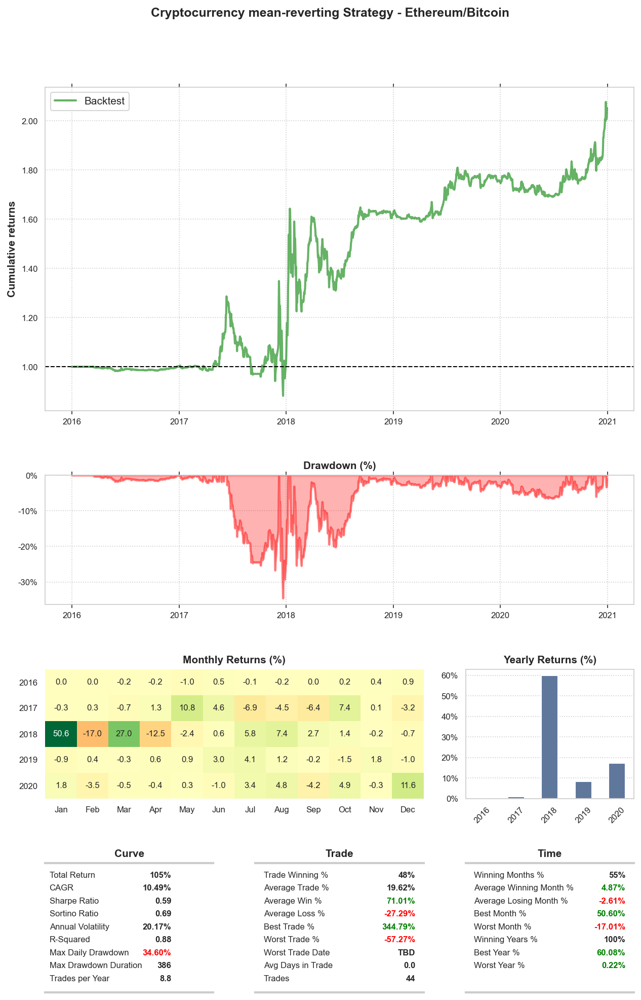

# Cointegrated Cryptocurrency trading strategy
In this project, we will explore how cointegrated cryptocurrency pair could lead to profitable mean-reverting trading opportunities. The hypothesis presented here is that the cryptocurrency price of Bitcoin (BTC) and Ethereum (ETH) could be cointegrated and thus lead to a potential mean-reverting trading strategy. We will first perform a linear regression between the two to obtain the slope coefficient/hedge ratio, and subsequently carry out a Cointegrated Augmented Dickey Fuller (CADF) test that confirms the cryptocurrency pair is stationary, by rejecting the null hypothesis. To backtest the strategy, we will utilize QSTrader backtesting simulation framework. The QSTrader framework has been simplified and updated to accommodate our strategy. In this example, we will utilize the Bollinger Bands to identify a mean-reverting series that deviate from its mean, a hedge position is opened and closed out when the mean-reverting series deviate and revert to its rolling mean respectively. Finally, a Tearsheet that shows the performance curve and other metrics for this strategy is shown as below: 



## Project Instructions

### Instructions

1. Open your terminal and clone the repository, then navigate to the the project folder.
```
git clone https://github.com/AndyTKH/Cointegration-Crypto.git                                                          
cd Cointegration-Crypto
```
2. Open the notebook to view the project. 
```
jupyter notebook cointegrated_crypto.ipynb
```
3. Simply close the terminal window to exit Jupyter Notebook. 
